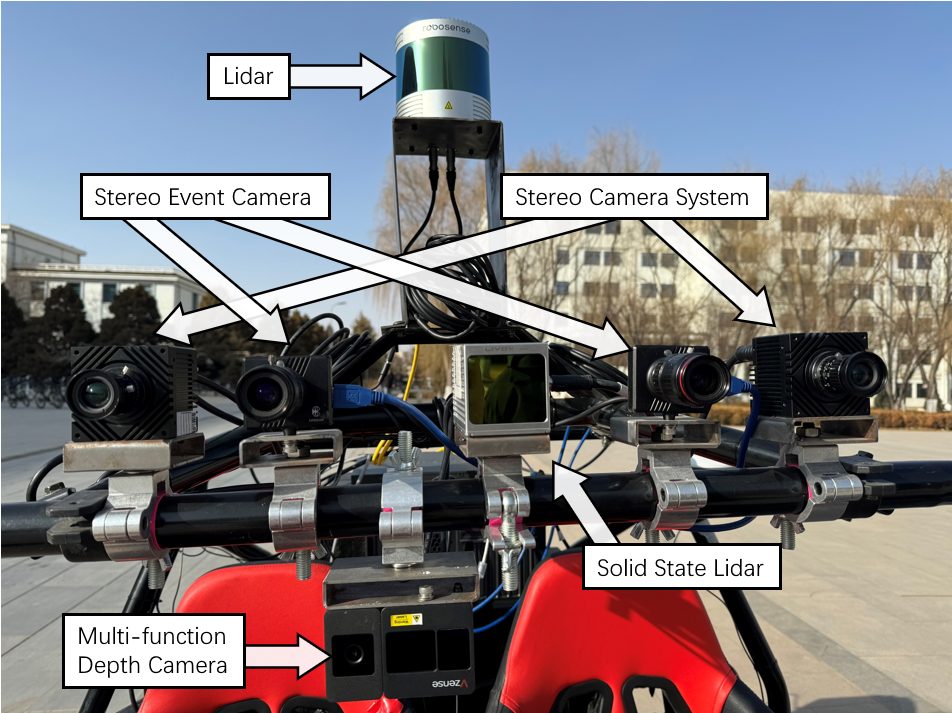
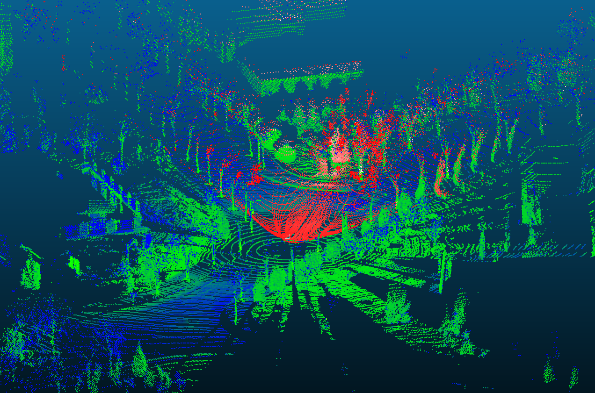
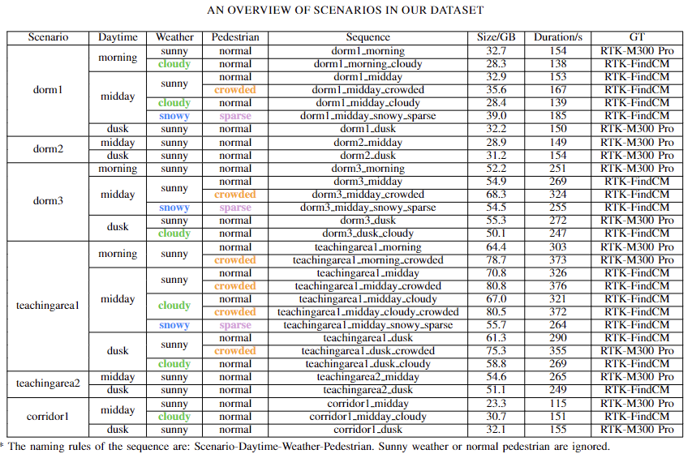

# MSDAD
This is the download cite of paper "MSDAD: A Multi-Sensor Dataset for Autonomous Driving"

The dataset will be open-sourced in 2025, and if you have any interest in the details, please don't hesitate to contact us: zhangzhh21@lzu.edu.cn/zhouqg@lzu.edu.cn.

## 1.ABSTRACT:
The development of autonomous driving relies significantly on high-quality datasets. Currently, there is a pressing need for abundant, diverse, and realistic datasets to drive advancements in autonomous driving technology. In this paper, we present a multi-sensor dataset specifically designed for autonomous driving. It incorporates advanced sensors such as a 128-beam Lidar, solid state Lidar, and event cameras. It not only provides precise trajectory ground truth for localization tasks but also offers real-time driver behavior for research such as reinforcement learning. To ensure the dataset reflects the real world, we took into account variations in lighting conditions, weather. This deliberate inclusion aims to provide realistic scenarios for researchers to comprehensively evaluate and optimize the performance of autonomous driving algorithms. Through this dataset, researchers can delve deeper into the challenges faced by autonomous driving technology, thereby driving innovation and progress in the field.
## 2.CONTRIBUTIONS
In this paper we present a multi-sensor dataset collected in real scenarios with precise trajectory ground truth and real-time driver behavior. The main contributions of this paper are summarized as follows:

① Multi kinds of sensors are used in our data acquisition vehicle, which provides diverse data types for researchers in the field of autonomous driving.

② Release a dataset focusing on localization challenges within autonomous driving. Variations include daytime, weather and pedestrian are considered.

③ The real-time driving behavior of driver are also provided in our dataset, which is used to provide data for deep learning, reinforcement learning and other tasks.

## 3.SENSOR SYSTEM
To provide diverse data for the autonomous vehicle localization system, our dataset incorporates a complicated sensor system. The Lidar is independently mounted on the platform of the vehicle to ensure no obstruction. The remaining sensors are positioned on the top of the windshield. Apart from these, RTK localization system is symmetrically placed at the rear of the vehicle.

### 3.1 Stereo Camera System
As the most fundamental visual sensor, we first provide image pairs from one stereo camera system. We select two Mind Version MV-XG280CG-T to capture RGB image. This device is capable of providing images with a maximum resolution of 1936x1464. Considering the redundancy in the captured range during practical usage, we crop the images from the original frame, selecting a resolution of 1600x800, starting from the top-left corner at coordinates 173x532. We also use hardware synchronization device to ensure the synchronous image capture within the stereo camera system, with a frequency set at 10Hz.

### 3.2 Stereo Event Camera
The event camera, a novel sensor, offers an efficient approach to capturing dynamic information in the scene, making it highly suitable for tasks such as object detection in autonomous driving. We choose the high-resolution event camera OmniVision CeleX5\_MP, which have a resolution of 1280×800. At the current stage, the event stream in our dataset includes information about the position, brightness value, and timestamp of each event. 

For visualization and calibration, we also provide overlaid event images. Specifically, we divide the event stream according to the timestamp of the event. For the events that fall into a certain time period, we aggregate event information based on their locations onto a single image. This method generates a binary image, representing the changes that occurred in the visible area during the specified time period. To better accommodate tasks such as depth reconstruction, our data collection vehicle is equipped with two event cameras to form a stereo vision system.

### 3.3 Lidar
The advancement in sensor technology has enabled vertical scanning of a greater number of laser beams by Lidar. This significant improvement in the richness of point cloud data is crucial for tasks such as Lidar localization. With this consideration in mind, we select RoboSense RS-Ruby mechanical Lidar to capture point cloud information surrounding the vehicle. In contrast to the majority of existing Lidar datasets, RS-Ruby is a 128-beam Lidar, which can provide astonishing high-quality point cloud. Its field of vision ranges from $0^\circ$ to $360^\circ$ horizontally and from -25° to +15° vertically, with a minimum 0.1° angle separation non-uniformly distributed. Most of the beams are concentrated in the middle while others are slightly sparse on both sides. We believe that the ultra-high resolution point cloud information in our dataset is of great significance for improving the localization and detection algorithm of autonomous driving.

### 3.4 Solid State Lidar
In consideration of the aesthetic requirements for vehicles, an increasing number of manufacturers in commercial autonomous driving development are opting for lightweight and compact solid state Lidar for environment perception. Unlike widely used mechanical Lidar that provide 360-degree horizontal perception, solid state Lidar employs a rosette-like scanning pattern to cover a certain range in the forward direction. In our dataset, we select Livox AVIA to provide an alternative form of point cloud. This sensor can perceive a vertical field of view of 77.2° and a horizontal field of view of 70.4° in a non-repeating scanning mode. Within a scanning time of 0.2 seconds, it can provide point cloud density equivalent to a 64-beam mechanical Lidar within a central radius of 10°.

### 3.5 Multi-function Depth Camera
To incorporate a wider range of data types, we also integrate Vzense DS77C Pro depth camera into our dataset. This sensor utilizes Time-of-Flight (TOF) technology, enabling a perception range of 0.15m to 5m. Notably, this device also features autonomous exposure, depth alignment, and other functionalities, allowing it to output RGB images, depth images, IR images, and aligned point cloud data. Although the depth map inevitably produces more noise due to the outdoor environment, the IR images and RGB images still has a good performance. Thus, we put this sensor at the location of the vehicle's rearview mirror, facing forward, to capture data of the scene directly ahead during normal vehicle operation. When single-camera image data is required, we highly recommend utilizing the images provided by this sensor.

### 3.6 Real-time Driving Behavior
In recent years, the emergence of end-to-end autonomous driving algorithms has led us to recognize the significant value associated with behavior that can reflect the driving process of human drivers. With this consideration in mind, we equip the vehicle chassis with a module of Drive By Wire(DBW), which allow driving, braking and steering of the chassis can be controlled by electrical signals rather than mechanical structures. At the present stage, the information we provide encompasses throttle position(0$\%$ to 100$\%$), brake position(0% to 100%), gear information, and steering angle information(-600° to 600°). 

Through this way, we successfully established the correlation between visual input and driver control behavior, which makes the dataset capable of reflecting the interaction between the driver and the environment. Through these driving behaviors, researchers can imbue their models with certain prior knowledge, enabling the models to learn and mimic these behaviors in the early stages of training. This accelerates the convergence process of the models. Subsequently, in the later stages of model training, employing exploratory methods such as reinforcement learning enhances the model's generalization capabilities. This fortifies the model's ability to handle complex scenarios, thereby improving the accuracy and safety of driving models.

## 4.SEQUENCES
The recording runs fully on the ROS. In our dataset, we provide abundant data, including a total of approximately 3TB raw rosbag files and extracted images and point clouds. The specific structure is illustrated in Fig.\ref{data structure}. Each sequence includes RGB stereo camera images, event streams, overlaid event images, point clouds from mechanical Lidar, point clouds from solid state Lidar combined with IMU data, localization information, RGB images from a multifunctional depth camera, IR images, depth images, and reconstructed point cloud information. Among them, the localization information comprises 32 key parameters, including latitude, longitude, altitude, Euler angles, and other vital details.

The dataset we have collected is derived from real-world environments, ensuring its authenticity and realism. An overview of our dataset is given in the following table:

## 5.ACKNOWLEGEMENT
This work was partially supported by National Key R\&D Program of China under Grant No. 2023YFB4503903 and 2020YFC0832500, National Natural Science Foundation of China under Grant No. U22A20261 and 61402210, Gansu Province Science and Technology Major Project - Industrial Project under Grant No. 22ZD6GA048, the Gansu Provincial Science and Technology Major Special Innovation Consortium Project (21ZD3GA002), the Open Project of Gansu Provincial Key Laboratory of Intelligent Transportation (No. GJJ-ZH-2024-002)

## 6.FUTURE PLAN
The data collection process is a protracted endeavor. In forthcoming endeavors, our focus will center on enhancing the richness of our dataset. We aim to bolster the dataset through the inclusion of detailed annotations, facilitating its utility in domains like object detection and semantic segmentation. Moreover, our strategy encompasses the integration of V2X (Vehicle-to-Everything) devices, facilitating data acquisition from both vehicles and intersections. Concurrently, we plan to amalgamate simulation frameworks like Carla to synthesize data that mirrors real-world scenarios, thus enhancing the dataset's breadth and expandability.
